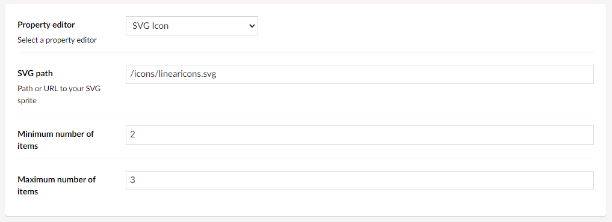
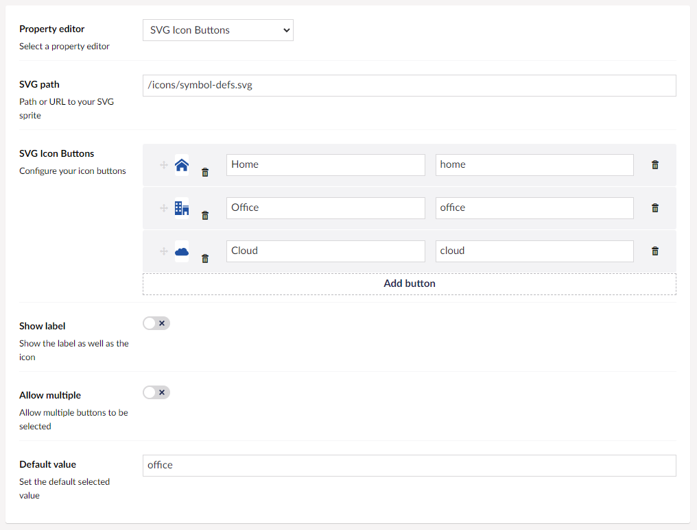
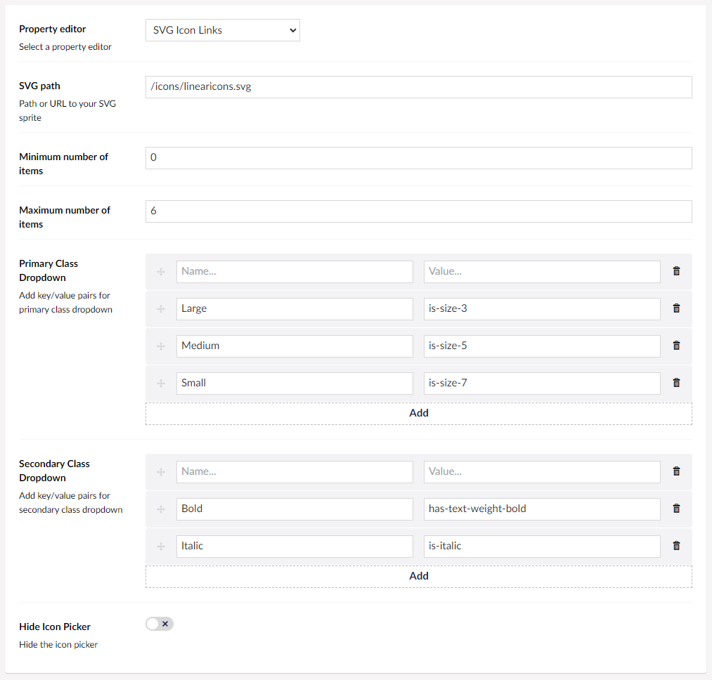
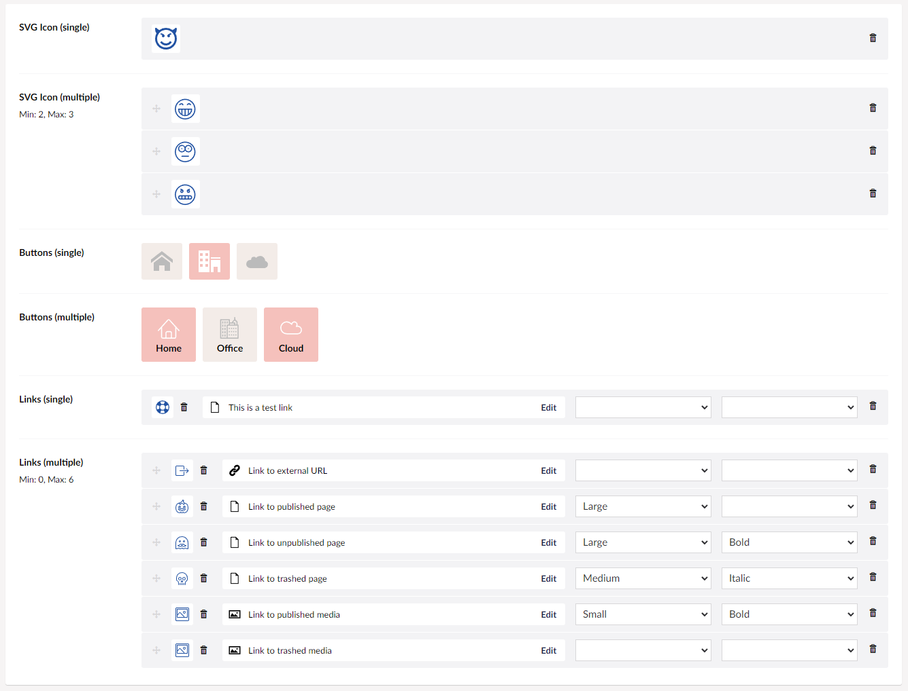

# SvgIconPropertyEditor #

Multiple property editors using icons from one or more SVG sprites:

* Icon Picker
* Icon Links (URL Picker with Icon Picker)
* Icon Buttons (back-office only)

The SVG sprite can vary per data type, so you can use multiple different icon sets.

#### SVG Icon

#### SVG Icon Buttons

#### SVG Icon Links

#### Property editors

#### Back-office credentials

Username: your@email.here
Password: 0123456789

